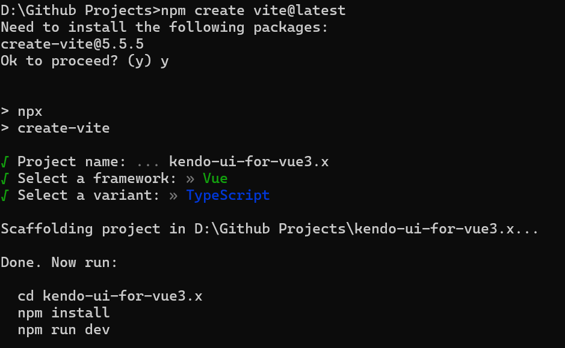

# Vue 3 + TypeScript + Vite

This template should help get you started developing with Vue 3 and TypeScript in Vite. The template uses Vue 3 `<script setup>` SFCs, check out the [script setup docs](https://v3.vuejs.org/api/sfc-script-setup.html#sfc-script-setup) to learn more.

Learn more about the recommended Project Setup and IDE Support in the [Vue Docs TypeScript Guide](https://vuejs.org/guide/typescript/overview.html#project-setup).

## Getting Started

## Command to create the app
```sh
npm create vite@latest
```



## Git setup and push your first commit to repository.

```sh
git init
git add .
git commit -m "Initial code setup."
git branch -M master
git remote add origin https://github.com/git-santhosh-kumar/kendo-ui-for-vue3.x.git
git push -u origin master
```

Below are the commands to update github config in git cli
```sh
git config user.name git-santhosh-kumar
git config user.email santhoshr.connect@gmail.com
```

## Add Kendo UI for Vue components

```sh
npm install --save @progress/kendo-vue-grid @progress/kendo-data-query @progress/kendo-vue-inputs @progress/kendo-vue-intl @progress/kendo-vue-dropdowns @progress/kendo-vue-dateinputs @progress/kendo-drawing @progress/kendo-vue-dialogs @progress/kendo-vue-data-tools @progress/kendo-vue-animation @progress/kendo-licensing @progress/kendo-svg-icons @progress/kendo-vue-indicators
```

Install the default theme for css styles
```sh
npm install --save @progress/kendo-theme-default
```

Install Vue Router
```sh
npm install vue-router@4 --save
```
